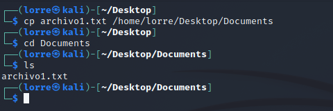
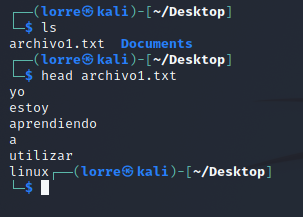
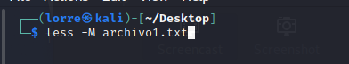
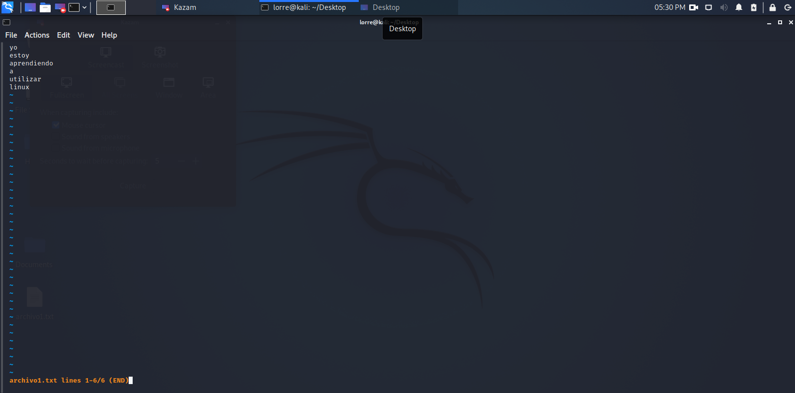
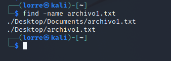

# <b>Comandos_Linux</b>

## <b>BASH</b>
Bash (Bourne-again-shell) es una interfaz de usuario de línea de controles, específicamente un shell de Unix; así como un lenguaje de scripting. Bash fue originalmente escrito por Brian Fox para el sistema operativo GNU, y pretendía ser el reemplazo de software libre del shell Bourne.

Lanzado por primera vez en 1989, se ha utilizado ampliamente como el intérprete de inicio de sesión predeterminado para la mayoría de las distribuciones de GNU/Linux, también de Mac OS X de Apple hasta la versión 10.15.

## <b>Comandos</b>

### <b>CD</b>
Ayuda a navegar por los archivos y directorios de Linux. te pedirá la ruta de trabajo actual en el que te encuentres.

### <b>PWD</b>
Nos permite saber la ubicación del directorio en el que nos encontramos.

### <b>LS</b>
Comando usado para ver el contenido de un directorio en el que estas. Si deseas ver el contenido de otros directorios, escribe ls y luego la ruta del directorio.

### <b>RMDIR</b>
Si necesitas eliminar un directorio, usa el comando rmdir. ~rmdir solo permite eliminar directorios vacíos.

### <b>TOUCH</b>
Con el comando touch podrás crear nuevos archivos en el directorio actual.

### <b>RM</b> 
Comando asignado para la eliminar archivos y directorios del sistema de archivos.

### <b>MV</b> 
Utilizado para renombrar directorios, archivos y mover archivos.

* Renombrar un archivo.

        $ mv nombre1.txt archivo1.txt

* Renombrar un directorio.

        $ mv directorio nueva-carpeta

* Mover archivos.

        $ mv archivo1.txt ./nueva-carpeta

### <b>CP</b>
Comando que nos permite copiar archivos de un directorio actual a un directorio diferente.

### <b>HEAD</b>
Muestra las primeras líneas de cualquier fichero. Normalmente usado para visualizar los primeros logs de error, para analizar cualquier problema en la ejecución de una web, para visualizar ele syslog, archivo log de sistema, etc.

### <b>LESS</b>
Visualizador de archivos de texto, permite navegar completamente por el contenido de un archivo utilizando pocos recursos del sistema.

### <b>CAT</b>
Lee el contenido de archivos y lo emite a la línea de comandos.

        $ cat filename.txt

### <b>WC</b>
Es un comando utilizado para realizar diferentes conteos desde la entrada estándar, ya sea de palabras caracteres o saltos de líneas.

        $ wc ideas.txt excerpt.txt 
        40     149     947 ideas.txt
        2294   16638   97724 excerpt.txt
        2334   16787   98671 total

### <b>CUT</b>
Comando utilizado para la extracción de segmentos (o porciones) de las líneas de texto, provenientes de un archivo o bien de la entrada estándar.

        $ cut -c 4-20 archivo.txt

### <b>GREP</b>
El comando grep consiste de tres partes en su forma más básica. La primera empieza con el comando mismo; grep. seguido de un patrón que nos va a permitir hacer la búsqueda, después viene el string del nombre del archivo que el grep se va a encargar de buscar.

*  Conteo de palabras que coinciden con la búsqueda.

        $ grep -c búsqueda archivo

*  Buscar múltiples palabras clave.

        $ grep búsqueda1 archivo

* Encontrar una palabra en un conjunto de archivos.

        $ grep -l palabra_a_buscar ./*

### <b>FIND</b>
Es un comando común en sistemas Unix que se utiliza para encontrar archivos en un determinado directorio a partir de diversas reglas de búsqueda, tales como nombre exacto de archivo, fecha de creación, tamaño, permisos, etc. llegando a ser muy flexible y una de las herramientas más útiles en la administración de sistemas cuando se sabe utilizar.

El comando find se podría usar de las siguientes maneras:

* Para buscar todos los archivos dentro de un directorio con extensión se utiliza el comando.

        $ find /home/usuario -name "*.txt"

* Para encontrar un archivo en todo el sistema, se debe buscarlo desde la carpeta root/ y para esto se utiliza el comando.

        $ find / -name [nombre_de_archivo]

* Para buscar un archivo por nombre de usuario se utiliza el comando.

        $ find / -user [nombre_usuario]

<b>NOTA:</b>Esto mostrará todos los archivos del usuario a partir de la carpeta root / y todas sus subcarpetas.

* Para buscar archivos vacíos se utiliza el comando.

        $ find . -size 0c

* Para buscar archivos de un tamaño en kilobytes se utiliza el comando.

        $ find . -size 54k

<b>NOTA:</b> El <b>(.)</b> indica en que directorio nos encontramos.

* Para buscar archivos de un tamaño determinado se utiliza el comando:

        $ find / -size [numero][unidad de tamaño]

* Para buscar archivos que tengan más de un tamaño determinado se utiliza el comando:

        $ find / -size +[numero][unidad de tamaño]

<b>NOTA:</b> Se debe tener en cuenta las siguientes unidades de tamaño:

* <b>c</b> – bytes.
* <b>k</b> – kilobytes.
* <b>M</b> – megabytes.
* <b>G</b> – gigabytes.
* <b>b</b> – trozos de 512 bytes.

### <b>MOUNT</b> 
Es un comando de sistemas basados en Unix que se utiliza para montar dispositivos y particiones para su uso por el sistema operativo. Montar es hacer que el sistema operativo proyecte el contenido de ese dispositivo o partición en un enlace lógico (un directorio). Cuando se desocupa se rompe el enlace y se sigue trabajando con los mismos archivos básicos.

El comando mount se podría usar de la siguiente manera:

        $ mount [-t <tipo>] [-o <opciones>] <dispositivo> <punto_de_lectura>

Ejemplo:

        $ mount -t iso9660 /dev/hdb0 /mnt/cdrom

        $ mount -t iso9660 -o loop /home/usuario/imagen.iso /mnt/imagenes

### <b>UMOUNT</b>
Es un comando de los sistemas operativos Unix y similares a Unix que le permite desconectar un sistema de archivos que se montó previamente, lo que le permite luego eliminar el medio en el que reside o realizar comprobaciones de coherencia (por ejemplo, a través del comando fsck).

El comando umount se podría usar de la siguiente manera:

        $ umount [opciones] [sistema_de_archivos_o_directorio]

### <b>PS</b>
Es un comando asociado en el sistema operativo UNIX que permite visualizar el estado de un proceso.

El comando ps se podría usar de la siguiente manera:

        $ ps [modificadores] [condición]

Donde los modificadores son opcionales, y puede tomar los siguientes valores:

Modificadores sin parámetro de condición:

* <b>-A:</b> Muestra todos los procesos (de todos los usuarios en el sistema).

* <b>-a:</b> Muestra todos los procesos de una [tty] determinada.

* <b>-d:</b> Muestra todo excepto los líderes de la sesión.

* <b>-e:</b> Muestra todos los procesos (equivalente a -A).

* <b>-T:</b> Muestra todos los procesos de la terminal actual.

* <b>-a:</b> Muestra todos los procesos de la terminal actual incluyendo los de otros usuarios.

* <b>-g:</b> Muestra todos los procesos incluyendo grupos líderes (obsoleta excepto en sunOs).

* <b>-r:</b> Muestra solamente los procesos corriendo.

* <b>-x:</b> Muestra los procesos en un estilo BSD (sin controlar la [TTY]).

* <b>-f:</b> Visualiza los parámetros con los que se levantó el proceso.

Modificadores con parámetro condición:

* <b>-N:</b> Muestra todos los procesos excepto los que encajan con la condición (equivalente a --deselect).

* <b>-C:</b> Muestra los procesos que tienen como nombre la condición.

* <b>-G:</b> Muestra los procesos que tienen como grupo (nombre de grupo o id) la condición.

* <b>-P:</b> Muestra los procesos que tienen como [Identificador de proceso] la condición.

* <b>-S:</b> Muestra los procesos que tienen como sesión la condición.

* <b>-U:</b> Muestra los procesos que tienen como usuario (nombre de grupo o id) la condición.

### <b>TOP</b>
Es un comando sencillo pero potente monitor de procesos que permite obtener una lectura en tiempo real de una cantidad diversa de información de nuestro GNU/Linux y del consumo de recursos que este está llevando a cabo, entre las que se encuentran el consumo de memoria, de los CPUs, la cantidad de usuarios, etc.

El comando top se podría usar de la siguiente manera:

        $ top [opción] [opción]

### <b>HTOP</b>
Es un comando que le permite al usuario monitorear de forma interactiva los recursos vitales del sistema o los procesos del servidor en tiempo real. htop es un programa más nuevo en comparación con el comando top y ofrece muchas mejoras sobre el comando top. htop admite la operación del mouse, usa color en su salida y brinda indicaciones visuales sobre el uso del procesador, la memoria y el intercambio. htop también imprime líneas de comando completas para procesos y permite desplazarse tanto vertical como horizontalmente para procesos y líneas de comando respectivamente.

El comando htop se podría usar de la siguiente manera:

        $ htop [-dChusv]

<b>NOTA:</b> El comando htop usa las siguientes opciones:

* <b>-d -delay :</b> Se utiliza para mostrar el retraso entre actualizaciones, en décimas de segundo.

* <b>-C -no-color –no-colour:</b> Inicie htop en modo monocromático.

* <b>-h -help:</b> Se usa para mostrar el mensaje de ayuda y salir.

* <b>-u -user = NOMBRE DE USUARIO:</b> Se utiliza para mostrar solo los procesos de un usuario determinado.

* <b>-p -pid = PID, PID…:</b> Se usa para mostrar solo los PID dados.

* <b>-s -sort -key COLUMN:</b> Ordenar por esta columna (use la ayuda de –sort-key para una lista de columnas).

* <b>-v -version:</b> Información de la versión de salida y salida.

### <b>KILL</b>
Es un comando que envía una señal de terminación. Su traducción directa es (matar) y es prácticamente lo que hace con los programas sobre los que se ejecuta. 

El comando kill se podría usar de las siguientes maneras:

* Para matar una aplicación se utiliza el comando.

        $ pkill [nombre_programa]

        $ killall [nombre_programa]

### <b>DATE</b>
Este comando se usa para obtener la fecha y hora actuales del sistema seleccionado, también este comando nos brinda la posibilidad de ver o calcular una fecha en un formato que especifiquemos o el usuario root podrá usarlo para configurar el reloj del sistema operativo en caso que sea necesario.

El comando date se podría usar de la siguiente manera:

        $ date [[Opciones de formatos][1_0]]

[1_0]: https://www.solvetic.com/tutoriales/article/4818-como-usar-el-comando-date-de-fecha-en-linux/

### <b>MAN</b>
Es una herramienta con la que contamos en los sistemas Unix o del tipo Unix, también conocida como páginas de manual, que se utiliza para acceder a la documentación disponible de sus herramientas y así aprender sobre comandos, archivos, llamadas de sistema, etc, en un sistema operativo tal y como GNU/Linux. Es la abreviatura de manual, proporciona información sobre el comando solicitado o permite a los usuarios buscar comandos relacionados con una determinada palabra clave.

El comando man se podría usar de la siguiente manera:

        $ man [comando]

## Mas recursos
* [Guia de comandos][3.1] 
* [Bash][3.2]
* [comandos][3.3]

[3.1]:https://www.dell.com/support/kbdoc/es-co/000123980/gu%c3%ada-sobre-comandos-del-terminal-ubuntu-linux-en-una-computadora-dell

[3.2]:https://es.wikipedia.org/wiki/Bash

[3.3]: https://ubunlog.com/comando-kill/

# Hecho por:
* Jhon Fabio España Cortes
* Diego Marcelo Jimenez Melendez
* Errol Vladimir Garcia Silva

Universidad De Nariño
