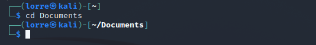
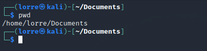
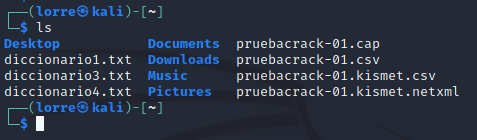
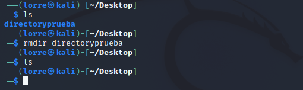
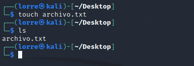

# Comandos_Linux

## Bash
Bash (Bourne-again-shell) es una interfas de usuario de linea de controles, especificamente un shell de Unix;
asi como un lenguaje de scripting. Bash fue originalmente escrito por Brian Fox para el sistema operativo GNU,
y pretendia ser el reemplazo de software libre del shell Bourne.

Lanzado por primera vez en 1989, se ha utilizado ampliamente como el interprete de inicio de sesion predeterminado para la mayoria de las distribuciones
de GNU/Linux, tambien de  Mac OD X de Apple hasta la version 10.15.

## Comandos

* Cd
Ayuda a navegar por los archivos y directorios de Linux. te pedira la ruta
de trabajo actual en el que te encuentres.

* pwd
Nos permite saber la ubicacion del direcrotio en el que nos encontramos.

* ls
comando usado para ver el contenido de un directorio en el que estas.
Si deseas ver el contenido de otros directorios, escribe ls y luego la ruta del directorio.

* rmdir
Si necesitas eliminar un directorio, usa el comando rmdir. ~rmdir solo permite eliminar directorios vacios

* touch
Con el comando touch podras crear nuevos archivos en el directorio actual.

## Mas recursos
* [Guia de comandos][3.1] 
* [Bash][3.2]

[3.1]:https://www.dell.com/support/kbdoc/es-co/000123980/gu%c3%ada-sobre-comandos-del-terminal-ubuntu-linux-en-una-computadora-dell
[3.2]:https://es.wikipedia.org/wiki/Bash
